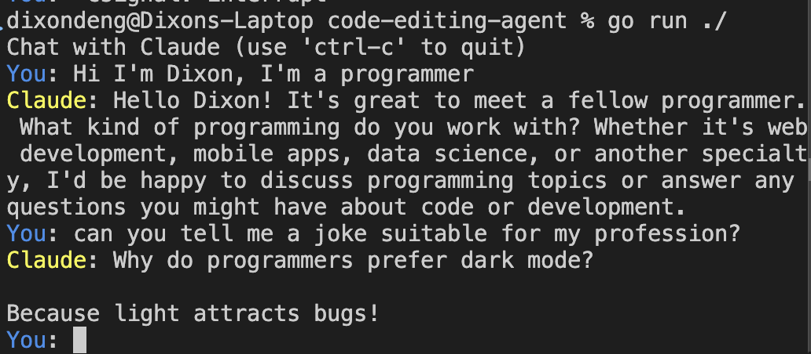
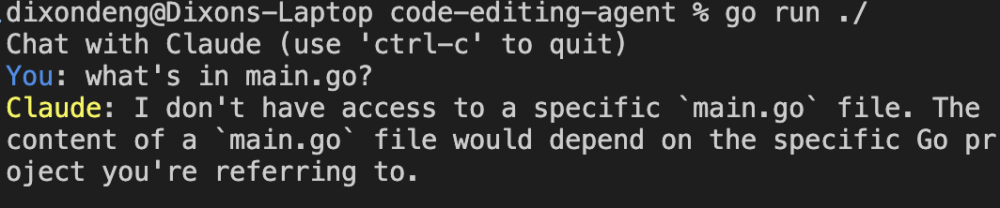
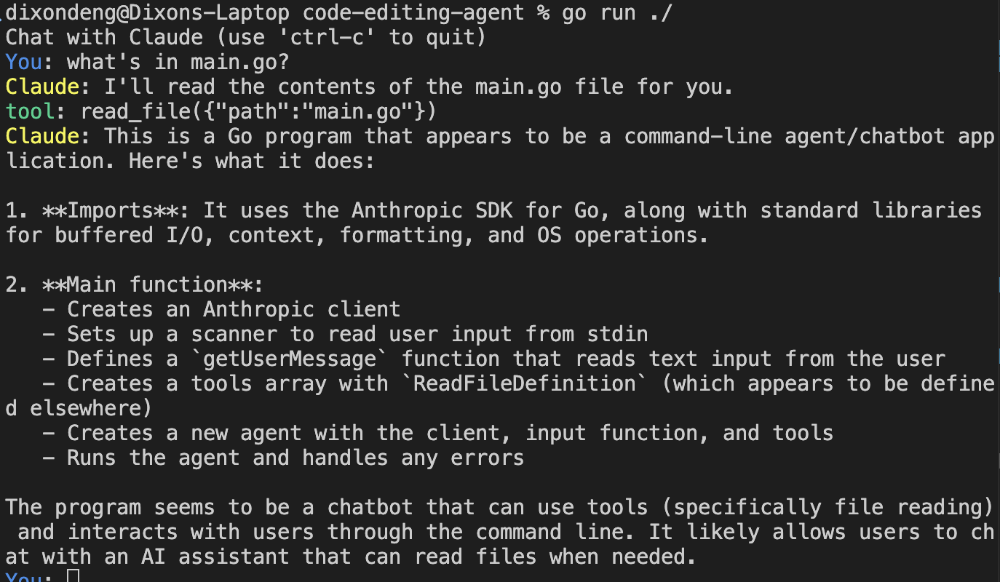
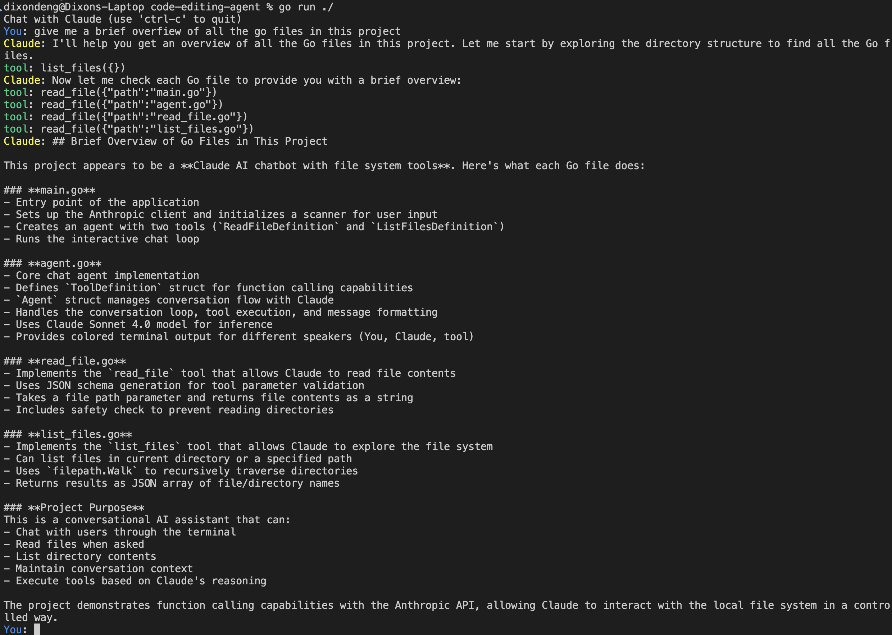
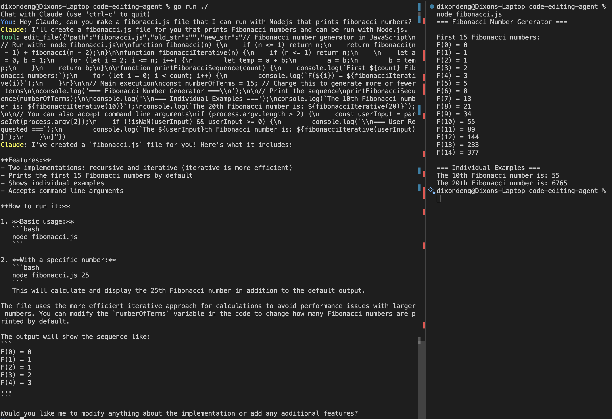
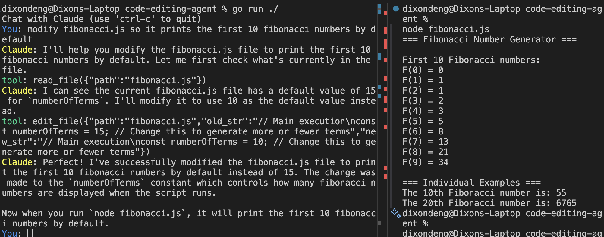

# How to build a coding Coding Agent in 300 Lines

based on ampcode's [How to Build an Agent](https://ampcode.com/how-to-build-an-agent)

---
<!--backgroundColor: orange -->

- hopefully this reveals some of the magic behind agentic code editing
- [spoiler] It's just an LLM + a `for` loop, and enough tokens
- don't believe me?

## Let's go...
---

### some boring stuff...
```bash
mkdir code-editing-agent
cd code-editing-agent
go mod init agent
touch main.go
```
---

### Some skeleton code - main.go
```go
package main

import (
	"bufio"
	"context"
	"fmt"
	"os"

	"github.com/anthropics/anthropic-sdk-go"
)

func main() {
	client := anthropic.NewClient()

	scanner := bufio.NewScanner(os.Stdin)
	getUserMessage := func() (string, bool) {
		if !scanner.Scan() {
			return "", false
		}
		return scanner.Text(), true
	}

	agent := NewAgent(&client, getUserMessage)
	err := agent.Run(context.TODO())
	if err != nil {
		fmt.Printf("Error: %s\n", err.Error())
	}
}


```

---
Our Agent
```go

package main

import (
	"context"
	"fmt"

	"github.com/anthropics/anthropic-sdk-go"
)


type Agent struct {
	client         *anthropic.Client
	getUserMessage func() (string, bool)
}

func NewAgent(client *anthropic.Client, getUserMessage func() (string, bool)) *Agent {
	return &Agent{
		client:         client,
		getUserMessage: getUserMessage,
	}
}

func (a *Agent) Run(ctx context.Context) error {
	conversation := []anthropic.MessageParam{}

	fmt.Println("Chat with Claude (use 'ctrl-c' to quit)")

	for {
		fmt.Print("\u001b[94mYou\u001b[0m: ")
		userInput, ok := a.getUserMessage()
		if !ok {
			break
		}

		userMessage := anthropic.NewUserMessage(anthropic.NewTextBlock(userInput))
		conversation = append(conversation, userMessage)

		message, err := a.runInference(ctx, conversation)
		if err != nil {
			return err
		}
		conversation = append(conversation, message.ToParam())

		for _, content := range message.Content {
			switch content.Type {
			case "text":
				fmt.Printf("\u001b[93mClaude\u001b[0m: %s\n", content.Text)
			}
		}
	}

	return nil
}

func (a *Agent) runInference(ctx context.Context, conversation []anthropic.MessageParam) (*anthropic.Message, error) {
	message, err := a.client.Messages.New(ctx, anthropic.MessageNewParams{
		Model:     anthropic.ModelClaudeSonnet4_0,
		MaxTokens: int64(1024),
		Messages:  conversation,
	})
	return message, err
}
```

---

that's it as a starting point! 
Let's run this

```bash
go mod tidy
go run ./
```

---



---

## Observations
- It keeps conversation context - it remembered my profession
- so far it's a chat bot, not an agent
- For it to be an agent, it has to **execute tools** to modify something outside of its context window

### Let's make a tool!

---

## Making the First Tool
- tool definition
- sending tools when running inference
- defining a `read_file` tool

--- 

### Defining tools

```diff

+ type ToolDefinition struct {
+ 	Name        string                         `json:"name"`
+ 	Description string                         `json:"description"`
+ 	InputSchema anthropic.ToolInputSchemaParam `json:"input_schema"`
+ 	Function    func(input json.RawMessage) (string, error)
+ }

type Agent struct {
	client         *anthropic.Client
	getUserMessage func() (string, bool)
+	tools 		[]ToolDefinition
}

func NewAgent(
	client *anthropic.Client,
	getUserMessage func() (string, bool),
+	tools []ToolDefinition,
) *Agent {
	return &Agent{
		client:         client,
		getUserMessage: getUserMessage,
+		tools:          tools,
	}
}

func main() {
    // [... previous code ...]
+	tools := []ToolDefinition{}
+	agent := NewAgent(&client, getUserMessage, tools)

    // [... previous code ...]
}

```

---

### Sending tools when running inference

```diff

func (a *Agent) runInference(ctx context.Context, conversation []anthropic.MessageParam) (*anthropic.Message, error) {
+	anthropicTools := []anthropic.ToolUnionParam{}
+	for _, tool := range a.tools {
+		anthropicTools = append(anthropicTools, anthropic.ToolUnionParam{
+			OfTool: &anthropic.ToolParam{
+				Name:        tool.Name,
+				Description: anthropic.String(tool.Description),
+				InputSchema: tool.InputSchema,
+			},
+		})
+	}

	message, err := a.client.Messages.New(ctx, anthropic.MessageNewParams{
		Model:     anthropic.ModelClaudeSonnet4_0,
		MaxTokens: int64(1024),
		Messages:  conversation,
+		Tools:     anthropicTools,
	})
	return message, err
}

```

---


### The `read_file` tool

```go

package main

import (
	"encoding/json"
	"os"

	"github.com/anthropics/anthropic-sdk-go"
	"github.com/invopop/jsonschema"
)


var ReadFileDefinition = ToolDefinition{
	Name:        "read_file",
	Description: "Read the contents of a given relative file path. Use this when you want to see what's inside a file. Do not use this with directory names.",
	InputSchema: ReadFileInputSchema,
	Function:    ReadFile,
}

type ReadFileInput struct {
	Path string `json:"path" jsonschema_description:"The relative path of a file in the working directory."`
}

var ReadFileInputSchema = GenerateSchema[ReadFileInput]()

func ReadFile(input json.RawMessage) (string, error) {
	readFileInput := ReadFileInput{}
	err := json.Unmarshal(input, &readFileInput)
	if err != nil {
		panic(err)
	}

	content, err := os.ReadFile(readFileInput.Path)
	if err != nil {
		return "", err
	}
	return string(content), nil
}

func GenerateSchema[T any]() anthropic.ToolInputSchemaParam {
	reflector := jsonschema.Reflector{
		AllowAdditionalProperties: false,
		DoNotReference:            true,
	}
	var v T

	schema := reflector.Reflect(v)

	return anthropic.ToolInputSchemaParam{
		Properties: schema.Properties,
	}
}

```

---

## Add tools to main.go

```diff
func main() {
    // [... previous code ...]

+    tools := []ToolDefinition{ReadFileDefinition}

+    agent := NewAgent(&client, getUserMessage, tools)
    
    // [... previous code ...]
}
```

---

### well that was a lot of code, does it run?



well that's...disappointing

---

We need to execute a tool on request

```diff
func (a *Agent) Run(ctx context.Context) error {
	conversation := []anthropic.MessageParam{}

	fmt.Println("Chat with Claude (use 'ctrl-c' to quit)")

+	readUserInput := true
	for {
+		if readUserInput {
			fmt.Print("\u001b[94mYou\u001b[0m: ")
			userInput, ok := a.getUserMessage()
			if !ok {
				break
+			}

			userMessage := anthropic.NewUserMessage(anthropic.NewTextBlock(userInput))
			conversation = append(conversation, userMessage)
		}

		message, err := a.runInference(ctx, conversation)
		if err != nil {
			return err
		}
		conversation = append(conversation, message.ToParam())

+		toolResults := []anthropic.ContentBlockParamUnion{}
		for _, content := range message.Content {
			switch content.Type {
			case "text":
				fmt.Printf("\u001b[93mClaude\u001b[0m: %s\n", content.Text)
+			case "tool_use":
+				result := a.executeTool(content.ID, content.Name, content.Input)
+				toolResults = append(toolResults, result)
			}
		}
+		if len(toolResults) == 0 {
+			readUserInput = true
+			continue
+		}
+		readUserInput = false
+		conversation = append(conversation, anthropic.NewUserMessage(toolResults...))
	}

	return nil
}
```

---

and here's the `executeTool` function

```go
func (a *Agent) executeTool(id, name string, input json.RawMessage) anthropic.ContentBlockParamUnion {
	var toolDef ToolDefinition
	var found bool
	for _, tool := range a.tools {
		if tool.Name == name {
			toolDef = tool
			found = true
			break
		}
	}
	if !found {
		return anthropic.NewToolResultBlock(id, "tool not found", true)
	}

	fmt.Printf("\u001b[92mtool\u001b[0m: %s(%s)\n", name, input)
	response, err := toolDef.Function(input)
	if err != nil {
		return anthropic.NewToolResultBlock(id, err.Error(), true)
	}
	return anthropic.NewToolResultBlock(id, response, false)
}
```

---

...and viola



---

it not only read the file but summarized it, ***without us prompting it to do so!***

Let's add a couple more tools

---

The `list_files` tool

```go
package main

import (
	"encoding/json"
	"os"
	"path/filepath"
)

var ListFilesDefinition = ToolDefinition{
	Name:        "list_files",
	Description: "List files and directories at a given path. If no path is provided, lists files in the current directory.",
	InputSchema: ListFilesInputSchema,
	Function:    ListFiles,
}

type ListFilesInput struct {
	Path string `json:"path,omitempty" jsonschema_description:"Optional relative path to list files from. Defaults to current directory if not provided."`
}

var ListFilesInputSchema = GenerateSchema[ListFilesInput]()

func ListFiles(input json.RawMessage) (string, error) {
	listFilesInput := ListFilesInput{}
	err := json.Unmarshal(input, &listFilesInput)
	if err != nil {
		panic(err)
	}

	dir := "."
	if listFilesInput.Path != "" {
		dir = listFilesInput.Path
	}

	var files []string
	err = filepath.Walk(dir, func(path string, info os.FileInfo, err error) error {
		if err != nil {
			return err
		}

		relPath, err := filepath.Rel(dir, path)
		if err != nil {
			return err
		}

		if relPath != "." {
			if info.IsDir() {
				files = append(files, relPath+"/")
			} else {
				files = append(files, relPath)
			}
		}
		return nil
	})

	if err != nil {
		return "", err
	}

	result, err := json.Marshal(files)
	if err != nil {
		return "", err
	}

	return string(result), nil
}
```

---

Don't forget to add the new tool to the list we send to Claude

```diff
// main.go

func main() {
	// [... previous code ...]

+ 	tools := []ToolDefinition{ReadFileDefinition, ListFilesDefinition}

	// [... previous code ...]
}
```

---

Claude combine tool use automatically!



---

### one last tool - `edit_file`

```go
package main

var EditFileDefinition = ToolDefinition{
	Name: "edit_file",
	Description: `Make edits to a text file.

Replaces 'old_str' with 'new_str' in the given file. 'old_str' and 'new_str' MUST be different from each other.

If the file specified with path doesn't exist, it will be created.
`,
	InputSchema: EditFileInputSchema,
	Function:    EditFile,
}

type EditFileInput struct {
	Path   string `json:"path" jsonschema_description:"The path to the file"`
	OldStr string `json:"old_str" jsonschema_description:"Text to search for - must match exactly and must only have one match exactly"`
	NewStr string `json:"new_str" jsonschema_description:"Text to replace old_str with"`
}

var EditFileInputSchema = GenerateSchema[EditFileInput]()

```
Food for thought - why string replacement???

---
The `EditFile` function

```go
func EditFile(input json.RawMessage) (string, error) {
	editFileInput := EditFileInput{}
	err := json.Unmarshal(input, &editFileInput)
	if err != nil {
		return "", err
	}

	if editFileInput.Path == "" || editFileInput.OldStr == editFileInput.NewStr {
		return "", fmt.Errorf("invalid input parameters")
	}

	content, err := os.ReadFile(editFileInput.Path)
	if err != nil {
		if os.IsNotExist(err) && editFileInput.OldStr == "" {
			return createNewFile(editFileInput.Path, editFileInput.NewStr)
		}
		return "", err
	}

	oldContent := string(content)
	newContent := strings.Replace(oldContent, editFileInput.OldStr, editFileInput.NewStr, 1)

	if oldContent == newContent && editFileInput.OldStr != "" {
		return "", fmt.Errorf("old_str not found in file")
	}

	err = os.WriteFile(editFileInput.Path, []byte(newContent), 0644)
	if err != nil {
		return "", err
	}

	return "OK", nil
}

```

---

The `createNewFile` function

```go
func createNewFile(filePath, content string) (string, error) {
	dir := path.Dir(filePath)
	if dir != "." {
		err := os.MkdirAll(dir, 0755)
		if err != nil {
			return "", fmt.Errorf("failed to create directory: %w", err)
		}
	}

	err := os.WriteFile(filePath, []byte(content), 0644)
	if err != nil {
		return "", fmt.Errorf("failed to create file: %w", err)
	}

	return fmt.Sprintf("Successfully created file %s", filePath), nil
}

```

---

Don't forget to add the new tool to the list we send to Claude

```diff
// main.go

func main() {
	// [... previous code ...]

+ 	tools := []ToolDefinition{ReadFileDefinition, ListFilesDefinition, EditFileDefinition}

	// [... previous code ...]
}
```

---

Ready to try out the shiny new tool?



---

That's pretty impressive!
How about making it *edit* a file, not just create one?



--- 

- this is pretty much the core inner workings of a code-editing agent
- the rest is elbow grease: polish and UI, multi-agent cooridnation, support across different models, etc
- ~300 lines that convinced me that agentic coding is the future

--- 

## Final thoughts

- why did edit file tool replace 1 string at a time? (why not ask Claude?)
- What about MCP?
  - MCP is a related concept - standizes protocols that allow AI agents to connect and interact with **external data sources and tools**
  - tools is about **what** an AI can do
  - MCP standizes **how** those connections are established and managed


     

